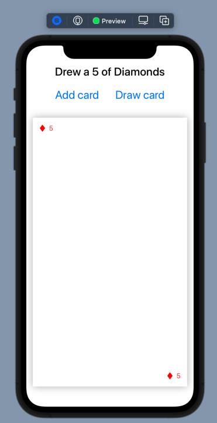

# Card-App-Module-2-Lesson-2-Challenge
This app represents a deck of cards, where you can add cards to the deck, and pull cards out of the deck. It is a tutorial app built by following CodeWithChris's 
amazing iOS Foundations course. In particular it is in response to the challenge app in the 
[iOS Foundations UISwift Module 2 Lesson 2](https://learn.codewithchris.com/courses/take/foundations/texts/19273518-lesson-2-challenge). Answer to the work [found here](https://www.dropbox.com/sh/gc91epvtjdwks19/AADc-pkl9h9B1VfQYlm_Z8ixa/Module%202/Lesson%2002?dl=0&file_subpath=%2FM2L2+Challenge%2FM2L2+Challenge%2FContentView.swift&preview=M2L2+Challenge+Solution.zip&subfolder_nav_tracking=1).

Note that all of the magic happens within the ContentView.swift file. In my solution, when you draw a card, it displays that card on the screen. I mistook at first the structure to represent the card to be a visual structure. However, I learned much in the process, like how to use the shadow, and get text to display at opposite corners within a rectangle. Still, I could use help on how to make the card text bigger. Another improvement would be to generate multiple suit symbols, such as 5 clubs in the center of the card, if the current card was a five of clubs.

